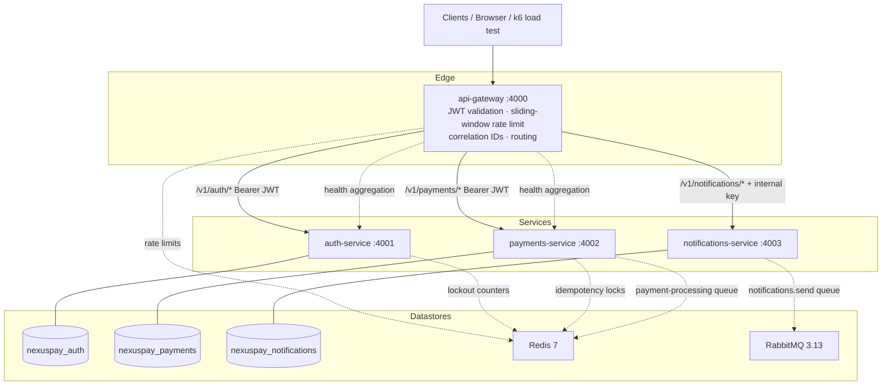

# NexusPay Platform — Architecture

## System Overview



## Request Flows

### Payment lifecycle (happy path)

```
POST /v1/payments (Idempotency-Key: abc)
  → gateway validates JWT, injects X-User-Id
  → payments-service idempotency middleware (Postgres replay + Redis lock)
  → createPayment: row INITIATED → PENDING, enqueue BullMQ job
  → worker: PROCESSING → mock provider decision (~90% success)
  → markSucceeded: SUCCEEDED + double-entry ledger rows in one transaction
     DEBIT  CUSTOMER_SOURCE   amountMinor
     CREDIT PAYMENTS_REVENUE  amountMinor - fee
     CREDIT PAYMENTS_FEES     fee
```

Failure at any transition is blocked by `payment-state-machine.ts`; refunds only from SUCCEEDED and write reversal entries.

### Login with MFA enabled

```
POST /v1/auth/login → { mfaRequired: true, challengeToken }   # 5-min JWT, type=mfa_challenge
POST /v1/auth/mfa/verify { challengeToken, code }
  → TOTP verify (otplib) → token pair issued
```

### Refresh rotation with reuse detection

```
POST /v1/auth/refresh { refreshToken }
  → decode: family_id must exist, family not revoked
  → SHA-256(refresh) must equal refresh_token_families.last_token_hash
      mismatch ⇒ REVOKE ENTIRE FAMILY + audit "auth.refresh.reuse_detected"
  → else rotate: new refresh JWT (same family_id), update last_token_hash
```

Ported from authcore-service (F2). Brute-force protection uses Redis per-account/per-IP counters → lockout keys → HTTP 423.

### Notification delivery

```
POST /v1/notifications (internal API key)
  → template validated, payload render-checked upfront
  → Notification row QUEUED → publish RabbitMQ (confirm channel, durable queue)
  → consumer prefetch=10: PROCESSING → up to 3 attempts w/ backoff
      each attempt recorded in delivery_attempts
  → SENT (+providerMessageId) or FAILED (+failureReason)
```

Senders are pluggable (`NotificationSender` interface): SMTP via nodemailer for EMAIL, mock provider for SMS.

## Cross-Cutting Decisions

| Decision | Rationale |
|---|---|
| Money as integer minor units | No floating-point drift; ledger sums stay exact |
| Double-entry ledger on payment success | Auditable money movement; reconciliation verifies debits == credits |
| Idempotency = Postgres record + Redis SETNX lock | Replay survives restarts; in-flight duplicates get 409 |
| Per-service database | Independent schema evolution; mirrors microservice data ownership |
| HS256 shared secret between auth/gateway/payments | Simple for single-platform deploy; swap to JWKS/RSA when services split teams |
| Gateway injects X-Internal-Api-Key to notifications | notifications-service stays unreachable without gateway credential |
| Correlation IDs end-to-end | X-Request-Id generated at edge, forwarded by proxies, echoed on errors |
| Circuit breaker on aggregation calls | Partial responses with `"error": "unavailable"` instead of cascading failure |

## Kubernetes Target Topology (Week 2)

- One Helm chart per service + shared library chart; HPA, PDB, probes, NetworkPolicy deny-all default
- ArgoCD ApplicationSet: nexuspay-dev / nexuspay-prod namespaces; image promotion dev → prod via git diff
- kube-prometheus-stack + Loki + Tempo; dashboards-as-code reused from D1 observability-platform
- Istio strict mTLS between namespaces; Kiali graph as evidence artifact
